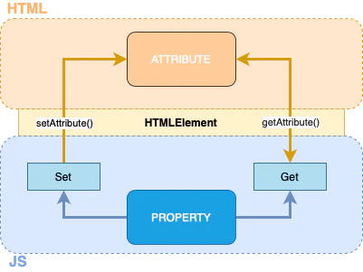

# Props

> - Props are arguments passed into JS components
> - Deliver structural information that unlike attributes, can be used by JS within components
> - We can also define our custom properties, to define the custom behaviours of our custom elements.
> - Properties can have any value and they are case sensitive.

All attributes and properties are a bit hard to understand by just looking into the code, it will get easier once you'll see it working in a real custom element. Meanwhile, remember the trick to achieve reflection: linking get/set property methods to get/set attribute methods

Maybe this schema will help clarify how attributes and properties reflection works:

## References

- https://www.freecodecamp.org/news/how-to-use-props-in-reactjs/
- https://javascript.works-hub.com/learn/web-components-api-definition-attributes-and-props-886c0
